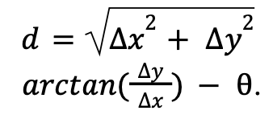

This project implements an Unscented Kalman Filter (UKF) to estimate the state of a wheeled mobile robot.

Execute `python run.py` to see a plot of the robot's trajectory plotted alongside an estimate of it from purely dead-reckoning. The next plot will show the state estimate after applying the UKF.

#### Motion Model
If there is only a translational speed, 𝑣, or if the rotational speed, 𝑤, is sufficiently small, the robot will move straight in the direction of its current heading. This position can be determined by:

    

If there is both a translational and rotational speed the robot will instead move in a curved path. The radius of curvature can be determined by 𝑅 = 𝑣/𝑤, and new positions can be given by:

    

The model is nonlinear; this can clearly be seen by how trigonometric functions are used to relate the inputs 𝑣, 𝑤 to the outputs 𝑥_𝑛𝑒𝑤 , 𝑦_𝑛𝑒𝑤, θ_𝑛𝑒𝑤. This nonlinearity is incompatible with filtering methods that
assume linear system dynamics, like the classic Kalman Filter. As a result, the use of an Unscented Kalman Filter (UKF) can help.

#### Measurement Model
The measurement model takes the current pose of the robot (𝑥, 𝑦, θ) , a landmark barcode number, and the ground truth position data of the landmarks as input. It associates the landmark barcode to its true position
UKF is more computationally expensive than the EKF given its propagation of sigma
and calculates the distance between it and the robot. It then calculates the relative bearing, or the angle between the robot’s orientation and the direction to that landmark.
A right triangle can be drawn with the hypotenuse being the distance from the robot to the landmark. Thus, it naturally follows that the distance and relative bearing be calculated as:

    

